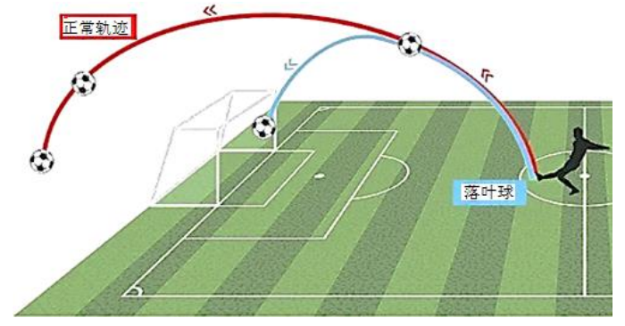
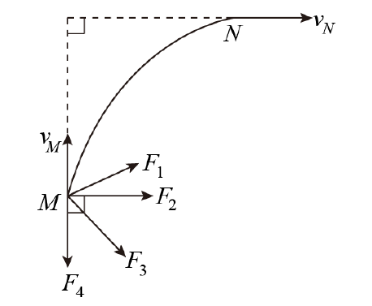
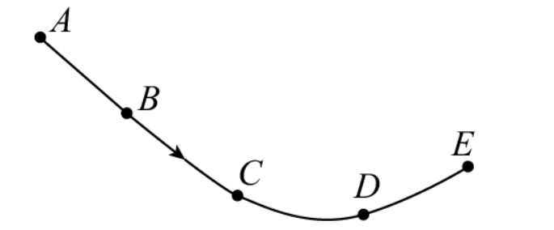

## 基础知识梳理

### 知识点1 曲线运动条件及特点

#### 速度的方向

速度的方向: 质点在某一点的速度方向,沿曲线在这一点的`切线方向`。

#### 运动的性质

运动的性质:做曲线运动的物体,速度的方向时刻在改变,所以曲线运动一定是`变速`运动。

#### 物体做曲线运动的条件

物体做曲线运动的条件:物体所受合力的方向与它的速度方向不在同一条直线上或它的加速度方向与速度方向不在同一条直线上。

#### 运动轨迹的判断

(1)若物体所受合力方向与速度方向在同一直线上,则物体做直线运动;若物体所受合力方向与速度方向不在同一直线上,则物体做曲线运动。

(2)物体做曲线运动时,合力指向轨迹的凹侧;运动轨迹在速度方向与合力方向所夹的区间。可速记为“无力不弯,力速两边”。

### 知识点1 曲线运动速率的变化
合力方向与速度方向的`夹角`和`速率变化`的关系
|锐角|直角|钝角|
| --- |--- | --- |
|速率增大|速率不变|速率减小|

## 题型归纳

### 考向1 曲线运动条件及特点

#### 第1题

1. 关于运动和力,以下说法正确的是(  )

A.物体在不垂直于速度方向的合力作用下,速度大小可能一直不变

B.物体受到变化的合力作用时,它的速度大小一定改变

C.物体受到的力不为恒力,物体一定做曲线运动

D.初速度不为零,并且受到与初速度方向不在同一条直线的外力作用,物体一定做曲线运动

>【答案】D
> >【详解】
> >
> >A.物体在不垂直于速度方向的合力作用下,由于合力对物体做功,所以速度大小一定变化,故A错误;
> >
> >B.物体受到变化的合力作用时,它的速度大小可以不改变,比如匀速圆周运动,故 B 错误;
> >
> >C.物体受到的力不为恒力,在变力的作用下不一定做曲线运动,如汽车恒定功率启动,合力不断变化,但是汽车做直线运动,故 C 错误;
> >
> >D.只有速度方向与合外力的方向不在一条直线上时,物体才做曲线运动,故 D 正确。

#### 第2题

2. “落叶球”是足球比赛中任意球的一种踢法,如图所示,这是某运动员主罚任意球时踢出快速旋转的“落叶球”在空中运动的轨迹跟正常飞行轨迹相比,“落叶球”会更早地向下落回地面。对“落叶球”在飞行过程中的分析正确的是( )

A.“落叶球”在空中的运动轨迹是对称的

B.“落叶球”的更早下落是因为在运动过程中受到了指向轨迹内侧的空气作用力

C.“落叶球”的更早下落是因为在运动过程中受到了沿切线方向的空气阻力

D.“落叶球”在最高点的瞬时速度为零
> 【答案】B
> >【详解】
> >
> > A.“落叶球”是快速旋转的球,所以在空中的轨迹不是对称的,A 错误;
> >
> > BC.根据做曲线运动的条件,“落叶球”的更早下落是因为在运动过程中受到了指向轨迹内侧的空气作用力,C 错误 B 正确;
> >
> > D.“落叶球”在最高点的竖直速度为零,水平速度不为零,所以瞬时速度不为零,D 错误。故选 B。

### 考向2 曲线运动速率的变化

#### 第3题

3.双人滑运动员在光滑的水平冰面上做表演,甲运动员给乙运动员一个水平恒力$F$,乙运动员在冰面上完成了一段优美的弧线$MN$。$v_M$与$v_N$正好成90°角,则此过程中,乙运动员受到甲运动员的恒力可能是图中的( )

A. $F_1$

B. $F_2$

C. $F_3$

D. $F_4$

> 【答案】C
> > 【详解】根据图示物体由 M 向 N 做曲线运动,物体向上的速度减小,同时向右的速度增大,故合外力的方向指向图 $F_2$ 水平线下方,故 $F_3$ 的方向可能是正确的。故选 C。

#### 第4题

4.图示为质点做匀变速运动的轨迹示意图,质点运动到D点时速度方向与加速度方向恰好垂直.则质点从A点运动到E点的过程中,下列说法中正确的是( )

A.质点经过 C 点的速率比 D 点大

B.质点经过 A 点时的动能小于经过 D 点时的动能

C.质点经过 D 点时的加速度比 B 点的加速度大

D.质点从 B 到 E 过程中加速度方向与速度方向的夹角一直减小

> 【答案】AD
> > 【详解】
> >
> > AB. 质点运动到 D 点时速度方向与加速度方向恰好互相垂直,速度沿 D 点轨迹的切线方向,则知加速度斜向左上方,合外力也斜向左上方,质点做匀变速曲线运动,合外力恒定不变,质点由 A 到 D 过程中,合外力做负功,由动能定理可得,C 点的速度比 D 点速度大,质点经过 A 点时的动能大于经过 D 点时的动能,故 A 正确,B 错误;
> >
> > C.质点做匀变速曲线运动,则有加速度不变,所以质点经过 D 点时的加速度与 B 点相同,故 C 错误;
> >
> > D.质点从 B 到 E 过程中加速度方向与速度方向的夹角一直减小,故 D 正确。故选 AD。
