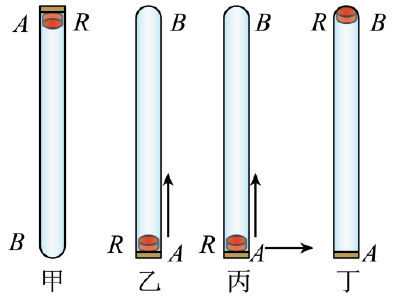
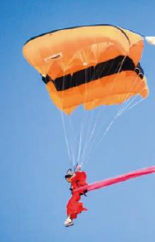
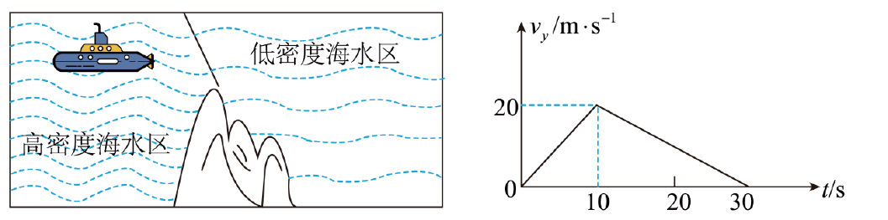
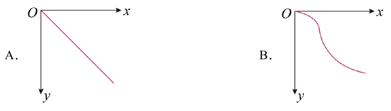
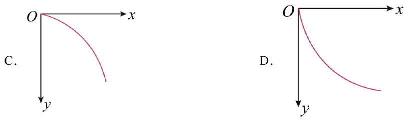
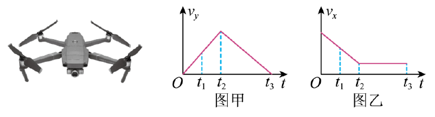

## 基础知识梳理

### 知识点1 合运动轨迹和性质的判断方法

#### 1.合运动轨迹和性质的判断方法

标准:看合初速度方向与合加速度(或合外力)方向是否`共线`

1. 若合加速度的方向与合初速度的方向在同一直线上,则为直线运动,否则为曲线运动。

2. 若合加速度不变,则为匀变速运动;若合加速度(大小或方向)变化,则为非匀变速运动。

|两个互成角度的分运动|合运动的性质|
| --- | --- |
|两个匀速 直线运动|匀速直线运动|
|一个匀速直线运动、一个匀变速直线运动|匀变速曲线运动|
|两个初速度为零的匀加速直线运动|匀加速直线运动|
|两个初速度不为零的匀变速直线运动|如果$v_合$与$a_合$共线,为匀变速直线运动;如果$v_合$与$a_合$不共线,为匀变速曲线运动|

### 知识点2 合运动与分运动的关系

#### 合运动与分运动的关系

|||
|---|---|
|等时性|合运动与分运动同时开始,同时进行,同时结束|
|独立性|各分运动相互独立,不受其他运动影响|
|等效性|各分运动的规律叠加起来与合运动的规律有完全相同的效果|

## 题型归纳

### 考向1 生活中的运动合成与分解

#### 第1题

1.如图甲所示,在长约 1m 的一端封闭的玻璃管中注满清水,水中放一个圆柱形的红蜡块 R(圆柱体的直径略小于玻璃管的内径,轻重适宜,使它能在玻璃管内的水中匀速上升),将玻璃管的开口端用胶塞塞紧.将此玻璃管迅速竖直倒置(如图乙所示) ,红蜡块 R 就沿玻璃管由管口 A 匀速上升到管底 B.若在将玻璃管竖直倒置、红蜡块刚从 A 端开始匀速上升的同时,将玻璃管由静止开始水平向右匀加速移动(如图丙所示) ,直至红蜡块上升到管底 B 的位置(如图丁所示).红蜡块与玻璃管间的摩擦很小,可以忽略不计,在这一过程中相对于地面而言()

A.红蜡块做速度大小、方向均不变的直线运动

B.红蜡块做速度大小变化的直线运动

C.红蜡块做加速度大小变化的曲线运动

D.红蜡块做加速度大小、方向均不变的曲线运动

> > 【答案】D
> >
> >【详解】蜡块在水平方向上做匀加速直线运动,竖直方向上做匀速直线运动,合加速度沿水平方向上,且大小不变,与合速度的方向不在同一条直线上,所以合运动为曲线运动,加速度保持不变.故 D 正确,ABC错误.故选 D.

#### 第2题

2.跳伞表演是观赏性很强体育项目,当运动员从直升飞机由静止跳下后,在下落过程中会受到水平风力的影响,如图所示,下列说法中正确的是( )

A.风力越大,运动员下落时间越长

B.风力越大,运动员着地速度越大

C.运动员下落时间与风力无关

D.运动员着地速度与风力无关

> 【答案】BC
> >
> >【详解】
> >
> >AC.运动员同时参与两个分运动,水平方向随空气匀速运动,竖直方向在降落伞张开前先加速,降落伞张开后先减速后匀速,由于竖直分运动不受水平分运动的干扰,故运动时间与风速无关,故 A 错误,
> >
> >C 正确;
> >
> >BD.运动员落地速度由水平分速度和竖直分速度合成,水平分速度由S风速决定,故风速越大,合速度越大,故 B 正确,D 错误。故选 BC。

### 考向2 有关运动合成与分解的图像问题

#### 第3题

3.潜艇从海水的高密度区驶入低密度区。浮力急剧减小的过程称为“掉深”。如图 a 所示,某潜艇在高密度区水平向右匀速航行, t = 0 时,该捞艇开始“掉深”,潜艇“掉深”后其竖直方向的速度 $v_y$ ,随时间变化的图像如图 b,水平速度 $v_x$ 保持不变,若以水平向右为 x 轴,竖直向下为 y 轴,则带艇“掉深”后的 0 ~ 30s 内。能大致表示其运动轨迹的图形是( )

>【答案】B
> >【详解】根据题意可知,潜艇在 x 轴方向上做匀速直线运动, y 轴方向上先做匀加速直线运动,再做匀减速直线运动,则 x − y 运动轨迹的图形,在 x 轴上取相邻距离相等的几段距离,则时间相等, y 轴上下降的距离先增大后减小。故选 B。

#### 第4题

4.2023年春季,和平区五大道的海棠花竞相绽放,绵延上千米的美景,吸引无数游人纷至沓来,成为春日津城最红打卡地。电视台摄制组为了拍到更广、更美的景色,采用了无人机拍摄的方法。现通过传感器将某台无人机上升向前拍摄的飞行过程转化为竖直向上的速度 $v_y$ 及水平方向速度 $v_x$ 与飞行时间 t 关系图象,如图甲、乙所示。图乙中 $t_2-t_3$ 段图象平行于 t 轴,则下列说法正确的是( )

A.无人机在 $t_1$ 时刻处于超重状态

B.无人机在 $0$~$t_2$ 这段时间内沿直线飞行

C.无人机在 $t_2$ 时刻上升至最高点

D.无人机在 $t_2$~$t_3$ 时间内做匀变速运动

>【答案】AD
> >【详解】
> >
> >A.由图像可知,无人机在 $t_1$ 时刻,竖直方向做匀加速直线运动,水平方向做匀减速直线运动,无人机有竖直向上的加速度,则可知无人机此刻处于超重状态,故 A 正确;
> >
> >B.由图像可知,无人机在 $0$~$t_2$ 这段时间内,竖直方向做匀加速直线运动,水平方向做匀减速直线运动,那么合加速度方向与初速度方向不共线,所以无人机做曲线运动,即无人机曲线上升,故 B 错误;
> >
> >C.无人机在竖直方向上,先向上做匀加速,后向上做匀减速,直至竖直方向的速度减为零,无人机才上升至最高点,而 $t_2$ 时刻是无人机加速向上结束的时刻,因此 $t_2$ 时刻无人机并未上升至最高点,故 C 错误;
> >
> > D.由图像可知,无人机在 $t_2$~$t_3$ 时间内,竖直方向做匀减速直线运动,水平方向做匀速直线运动,只有竖直方向有加速度且恒定,因此可知无人机在 $t_2$~$t_3$ 时间内做匀变速运动,故 D 正确。故选 AD。

