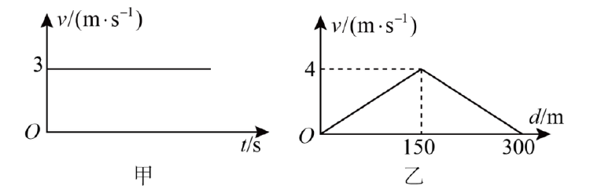
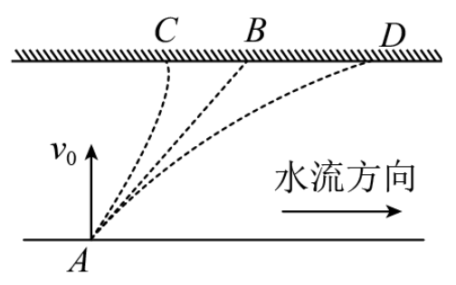
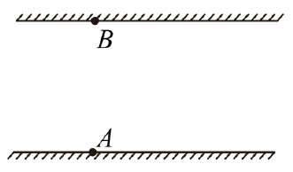
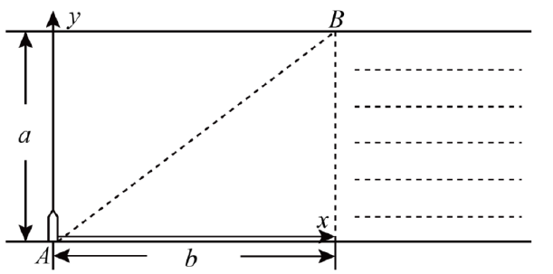

## 基础知识梳理

### 知识点 小船渡河的两种方式

#### 船的实际运动

船的实际运动:是水流的运动和船相对静水的运动的合运动。

#### 三种相关速度

船在静水中的速度 $v_船$、水的流速 $v_水$ 、船的实际速度 $v$。

#### 两种渡河方式

##### 渡河时间最短

当船头垂直河岸时,渡河时间最短,最短时间$t_min=\frac{d}{v_船}$

##### 渡河位移最短

当$v_水<v_船$时,如果满足$v_水-v_船 \cos θ=0$,渡河位移最短,$x_{min}=d$

当 $v_水>v_船$ 时,如果船头方向(即 $v_船$方向)与合速度方向垂直,渡河位移最短,最短渡河位移为$x_{min} =\frac{d v_水}{v_船}$

## 题型归纳

### 考向1 小船渡河最短时间问题

#### 第1题

1. 船在静水中的速度与时间的关系如图甲所示,河水的流速与船离河岸的距离的变化关系如图乙所示,河
宽为 300 m ,则当船沿渡河时间最短的路径渡河时( )

A.船渡河的最短时间是 60 s

B.要使船以最短时间渡河,船在行驶过程中,船头必须始终与河岸垂直

C.船在河水中航行的轨迹是一条直线

D.船在河水中的最大速度是 7 m/s

>【答案】B
> >【详解】AB.河宽 d =300m ,由题图甲知船在静水中的速度恒为 $v_1 = 3m/s$ ,要想渡河时间短,船头方向必须与河岸垂直,最短时间 t = 100s ,A 错误,B 正确;
> >
> > C.船参与了两种运动,沿垂直河岸方向的匀速运动,沿水流方向的变速运动,合运动是曲线运动,C 错误;
> >
> > D.由题图乙知河中心的水流速最大,且为 $v_2 = 4 m/s$ ,船的最大速度应为 $v_m = \sqrt{v_1^2 + v_2^2} = 5m/s$ ,D 错误。
> >
> > 故选 B。

#### 第2题

2.一小船过河的运动轨迹如图所示。河中各处水流速度大小相同且恒定不变,方向平行于岸边。若小船相对于静水分别做匀加速、匀减速、匀速直线运动,船相对于静水的初速度均相同(且均垂直于岸边)。由此可以确定( )

A.船沿 AC 轨迹运动时,船相对于静水做匀加速直线运动

B.船沿 AC 轨迹渡河所用的时间最短

C.船沿 AD 轨迹到达对岸前瞬间的速度最小

D.船沿三条不同轨迹渡河所用的时间相同

> 【答案】ABC
> > 【详解】ABD.加速度的方向指向轨迹的凹侧,依题意可知,AC 轨迹是匀加速运动,AB 轨迹是匀速运动,AD 轨迹是匀减速运动,故船沿 AC 轨迹过河所用的时间最短,选项 D 错误,AB 正确;
> >
> > C.船沿 AD 轨迹在垂直河岸方向的运动是减速运动,故船到达对岸的速度最小,选项 C 正确。故选 ABC。

### 考向2 小船渡河最短距离问题

#### 第3题

3.如图所示,小船(视为质点)从岸边 A 点开始渡河,河两岸平行,河的宽度为 150m,水流速度大小为3m/s,船在静水中的速度大小为 4m/s,则( )

A.船不可能到达正对岸 B 点

B.船的最短过河时间为 37.5s

C.船要以最短路程过河,船头必须指向正对岸

D.船以最短路程过河时的速率为$ \sqrt{7}$ m/s$

> 【答案】BD
> > 【详解】ACD.由于船在静水中的速度大于水流的速度,当速度满足如图所示关系时,船垂直河岸过河,此时为最短路程过河,船头方向与 $v_相对$ 方向相同,过河时的速率为 $v = \sqrt{v_{相对}^2 − v_水^2}= 7 m/s$, 故 AC 错误,D 正确;
> >
> > B.船头垂直河岸过河时,时间最短,则有 $t_{min} =\frac{d}{v_{相对}} = 37.5s$。故 B 正确。故选 BD。

#### 第4题

4.如图所示,河水流动的速度为 v 且处处相同,河宽度为 a,在船下河水点 A 的下游距离为 b 处是瀑布。为了使小船安全渡河(不掉到瀑布里去,且不考虑船在 A 对面的上游靠岸)( )

A.小船船头垂直河岸渡河时间最短,最短时间为 $t =\frac{b}{a}$

B.小船轨迹沿 y 轴方向渡河位移最小,合速度最大,最大值为 $v_{max} = \frac{\sqrt{a^2+b^2}}{b}v$

C.小船沿轨迹 AB 运动位移最大,船速最小值为 $v_{min} =\frac{av}{v}$

D.小船沿轨迹 AB 运动位移最大,船速最小值为 $v_min =\frac{av}{\sqrt{a^2+b^2}}$

>【答案】D
> > 【详解】A.当小船船头垂直河岸渡河时间最短,最短时间为 $t =\frac{a}{v_船}$ 故 A 错误;
> >
> > B.小船轨迹沿 y 轴方向渡河位移最小,为 a,但沿着船头指向的分速度速度必须指向上游,合速度不是最大,因此船的航行速度也不是最大的,故 B 错误;
> >
> > CD.要合速度要沿着 AB 方向,此时位移显然是最大的,划船的速度最小,即当船在静水中速度垂直合速度时,则有$\frac{v_{min}}{v} = \frac{a}{\sqrt{a^2+b^2}} $，则有 $v_{min} = \frac{av}{\sqrt{a^2+b^2}} $ \.故 C 错误,D 正确。故选 D。

