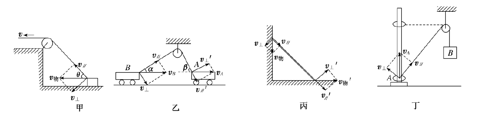
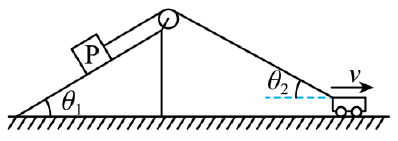
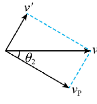
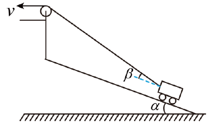
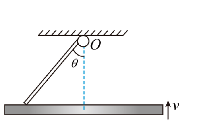
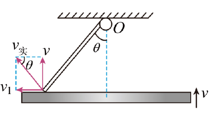
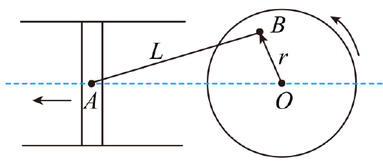
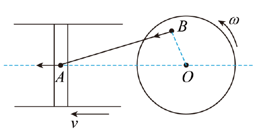

## 基础知识梳理

### 知识点1 分解思路

#### 模型特点

模型特点:沿绳(杆)方向的速度分量大小相等。

#### 分解思路

1. 研究对象：绳与物/杆与物的接触点

2. 合运动：接触点的运动

3. 分解方向：沿着绳或杆方向/垂直绳或杆方向

4. 突破口：沿着绳或杆方向的分速度大小相等

#### 知识点 2 解题原则

把物体的实际速度分解为垂直于绳(杆)和平行于绳(杆)两个分量,根据沿绳(杆)方向的分速度大小相等求解。常见的模型如图所示

## 题型归纳

### 考向1 绳类关联速度

#### 第1题

1.质量为m的物体 P 置于倾角为 $\theta_1$ 的固定光滑斜面上,轻细绳跨过光滑定滑轮分别连接着 P 与小车, P 与滑轮间的细绳平行于斜面,小车以速率 v 水平向右做匀速直线运动,当小车与滑轮间的细绳和水平方向成夹角$\theta_2$ 时 ( 如图 ) ,下列判断正确的是 ( )

A. P 的速率为 v

B. P 的速率为 $v \cos \theta_2$

C.绳的拉力等于 $mg \sin \theta_1$

D.绳的拉力小于 $mg \sin \theta_1$

> 【答案】B
> >【详解】
> >
> >AB.将小车的速度 v 沿绳子方向和垂直于绳子方向正交分解,如图所示
> > 
> >
> >物体 P 的速度与小车沿绳子方向的速度相等,则有 $v_P = v \cos \theta_2$ 故 B 正确,A 错误;
> >
> >CD.小车向右运动,所以$\theta_2$减小, v 不变,所以 $v_P$ 逐渐变大,说明物体 P 沿斜面向上做加速运动。对物体P 受力分析可知,物体 P 受到竖直向下的重力,垂直于斜面向上的支持力,沿绳向上的拉力 T,沿斜面和垂直斜面建立正交轴, 沿斜面方向由牛顿第二定律可得$ T - mg \sin \theta_1 = ma $可得 $T > mg \sin \theta_1 $故 CD 错误。故选 B。

#### 第2题

2.如图所示,某人通过跨过定滑轮的绳子将小车拉上倾角为$\alpha$的光滑斜面,人拉动绳子的速度 v 恒定,下列说法正确的是( )

A.小车沿斜面上升的过程中,人对绳子拉力恒定

B.小车沿斜面上升的过程中,小车的动能先增大后减小

C.小车沿斜面上升 h 高的过程中,绳子拉力对小车做的功大于小车重力势能的增加量

D.当绳子与斜面斜边的夹角为$\beta$时,小车的速度为$\frac{v}{\cos(\alpha+\beta)}$

> 【答案】C
> >【详解】BD.由题意可知,小车速度的方向为沿斜面向上,设小车的速度为 $v_车$ ,将小车速度分解为沿绳子收缩方向与垂直绳子方向,则 $v_车 \cos \beta = v $因此 $v_车 =\frac{v}{\cos \beta}$.由于人拉动绳子的速度 v 恒定,小车沿斜面向上运动的过程中 $\beta$ 越来越大,因此小车速度 $v_车$ 也越来越大,小车的动能一直增加,故 BD 错误。
> >
> > A.对小车进行受力分析,设绳子的拉力沿斜面的分力为 F ,则 $F = F_拉 \cos \beta$.由余弦函数性质可知,在 0 到 90 度范围内,角度越大,变化越快,因此$\beta$增大时,小车的速度$\frac{v}{\cos \beta}$增大,变化速度也增大,即加速度增大,所以绳子拉力沿斜面的分力 F 增大,而 $\cos \beta$减小,因此人对绳子的拉力 $F_拉$ 增大,故 A 错误;
> >
> > C.小车在沿斜面上升 h 高的过程中,仅绳子的拉力和重力对小车做功,其中绳子的拉力对小车做正功,重力对小车做负功。设此过程中绳子的拉力对小车做功大小为 $W_F$ ,重力对小车做功大小为 $W_G$ ,由于过程中小车速度越来越大,因此根据动能定理可得 $W_F − W_G = \Delta E_k > 0$ 因此 4W_F > W_G$.由于重力对小车做负功的大小等于小车重力势能的增加量,因此此过程中绳子拉力对小车做的功大于小车重力势能的增加量,故 C 正确。
> >
> >故选 C。

### 考向2 杆类关联速度

#### 第3题

3.如图所示,长为 L 的直棒一端可绕固定轴 O 转动,另一端搁在水平升降台上,升降平台以速度 v 匀速上升,当棒与竖直方向的夹角为$\theta$时,棒的角速度为( )

A. $\frac{v \sin \theta}{L}$

B. $\frac{v}{L \cos \theta}$

C. $\frac{v \cos \theta}{L}$

D. >$\frac{v}{L \sin \theta}$

> 【答案】D
> > 【详解】棒与平台接触点的实际运动即合运动,方向垂直于棒指向左上方,如图所示,合速度为 $v_实=\omega L$
> >
> >
> >
> > 竖直向上的速度分量等于平台上升的速度 v,即 $\omega L \sin \theta = v$,所以$ \omega =\frac{v}{L \sin \theta}$,故选 D。

#### 第4题

4.如图所示,压缩机通过活塞在汽缸内做往复运动来压缩和输送气体,活塞的中心 A 与圆盘在同一平面内,O为圆盘圆心,B 为圆盘上一点,A、B 处通过铰链连接在轻杆两端,圆盘绕过 O 点的轴做角速度为 $\omega$的匀速圆周运动。已知 O、B 间距离为 r,AB 杆长为 L ,则( )

A.L 越大,活塞运动的范围越大

B.圆盘半径越大,活塞运动的范围越大

C.当 OB 垂直于 AB 时,活塞速度为 $\omega r$

D.当 OB 垂直于 AO 时,活塞速度为 $\omega r$

> 【答案】D
> >【详解】AB.当 B 点在圆心左侧水平位置时,活塞运动到最左位置,距离 O 点 $s_1 = L + r$. 当 B 点在圆心右侧水平位置时,活塞运动到最右位置,距离 O 点 $s_2 = L − r$. 所以活塞运动范围为 $s 1 − s2 = 2r $,此距离与 L 无关,与 r 成正比,与圆盘半径无关,故 AB 错误;
> >
> > C.当 OB 垂直于 AB 时, 如下图所示.此时 B 点的速度方向一定沿杆,则 $v_A \neq v_B$ 故 C 错误;
> >
> > 
> >
> > D.圆盘 B 点速度 $v_B = r \omega $ 当 OB 垂直于 AO 时,如下图所示.
> > 此时活塞速度方向与圆盘上 B 点速度方向相同,速度方向与杆夹角$\theta$相同,沿杆速度 $v_B \cos \theta = v_A \cos \theta$,此时有 $v_A = v_B = r \omega $ 故 D 正确。故选 D。
> > 
