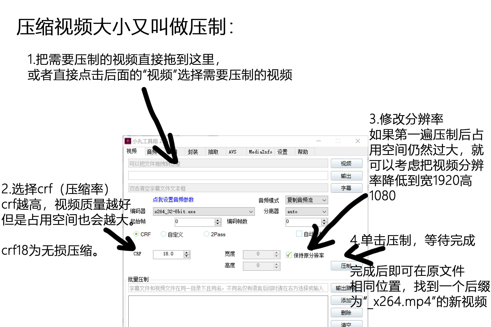

# markdown基本语法

`Markdown`是一种轻量级标记语言，排版语法简洁，让人们更多地关注内容本身而非排版。它使用易读易写的纯文本格式编写文档，可与HTML混编，可导出 HTML、PDF 以及本身的 .md  格式的文件。因简洁、高效、易读、易写，Markdown被大量使用，如Github、Wikipedia、简书等。 

千万不要被「标记」、「语言」吓到，Markdown的语法十分简单，常用的标记符号不超过十个，用于日常写作记录绰绰有余，不到半小时就能完全掌握。

就是这十个不到的标记符号，却能让人**优雅地沉浸式记录，专注内容而不是纠结排版**，达到「心中无尘，码字入神」的境界。

## markdown标题语法

 要创建标题，请在单词或短语前面添加`井号+空格`（# ）;

井号的数量代表了标题的级别，例如：

# 一级标题

\# 一级标题

## 二级标题

\## 二级标题

### 三级标题

\### 三级标题

#### 四级标题

\#### 四级标题

##### 五级标题

\##### 五级标题

###### 六级标题

\###### 六级标题

## markdown段落语法

要创建段落，请使用`空白行`将一行或多行文本进行分隔。

## markdown强调语法

### 斜体

文本内容前后各加上1个\*，例如：

\*曲线运动\*  ---> **曲线运动**

### 粗体

文本内容前后各加上两个\*，例如：

\*\*曲线运动\*\*  ---> **曲线运动**

### 短代码

将文本包裹在双反引号(\`\`)中，例如：

\`曲线运动\`  ----> `曲线运动`

## markdown引用语法

要创建块引用，请在段落前添加一个 `>` 符号，例如：

\>

>

块引用可以包含多个段落。为段落之间的空白行添加一个 `>` 符号，例如：
\> 曲线
\>
\> 曲线（curve，curved line）是平滑弯曲的线段或线条，也指动点运动方向连续变化的轨迹。 

> 曲线
>
> 曲线（curve，curved line）是平滑弯曲的线段或线条，也指动点运动方向连续变化的轨迹。 

块引用可以嵌套。在要嵌套的段落前添加一个 >> 符号，例如：

\> \> 曲线
\>
\> \> 曲线（curve，curved line）是平滑弯曲的线段或线条，也指动点运动方向连续变化的轨迹。 

> > 曲线
>
> > 曲线（curve，curved line）是平滑弯曲的线段或线条，也指动点运动方向连续变化的轨迹。 

## markdown列表语法

### 有序列表

`数字+英文句号+空格`

1.  
2.  
3.  
4.  

### 无序列表

请在每个列表项前面添加破折号 (-)、星号 (*) 或加号 (+) 

-  
-  
-  
-  

## markdown链接语法

链接文本放在中括号内，链接地址放在后面的括号中，链接title可选。

超链接Markdown语法代码：`[超链接显示名](超链接地址 "超链接title")`

> 悬停时会显示超链接title

[超链接显示名](超链接地址 "超链接title")

## Markdown 图片语法

### 图片的存放位置

在你保存.md后缀的相同位置处，快捷键`ctrl+shift+N`新建一个文件夹，命名为`pic`。将图片按顺序`命名`好(最好是数字，这样后面引用会很简单)

### 图片的引用方法

\!\[替换文本]\(图片链接 "图片title")

替换文本：当图片无法显示的时候出现的替换文字

图片链接：图片所处的位置

图片title：悬停时，鼠标会显示图片的title

例如：

\!\[压制视频]\(1.png "压制视频")

